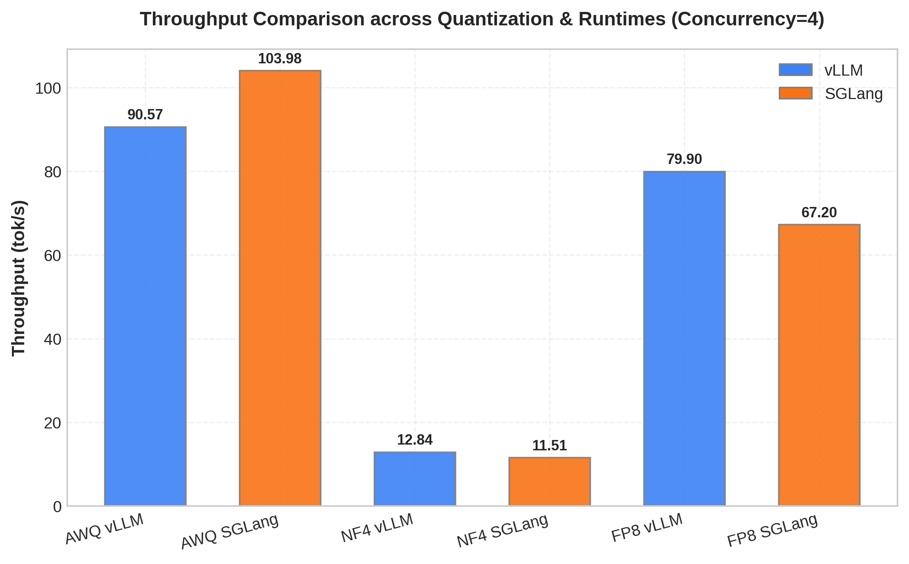
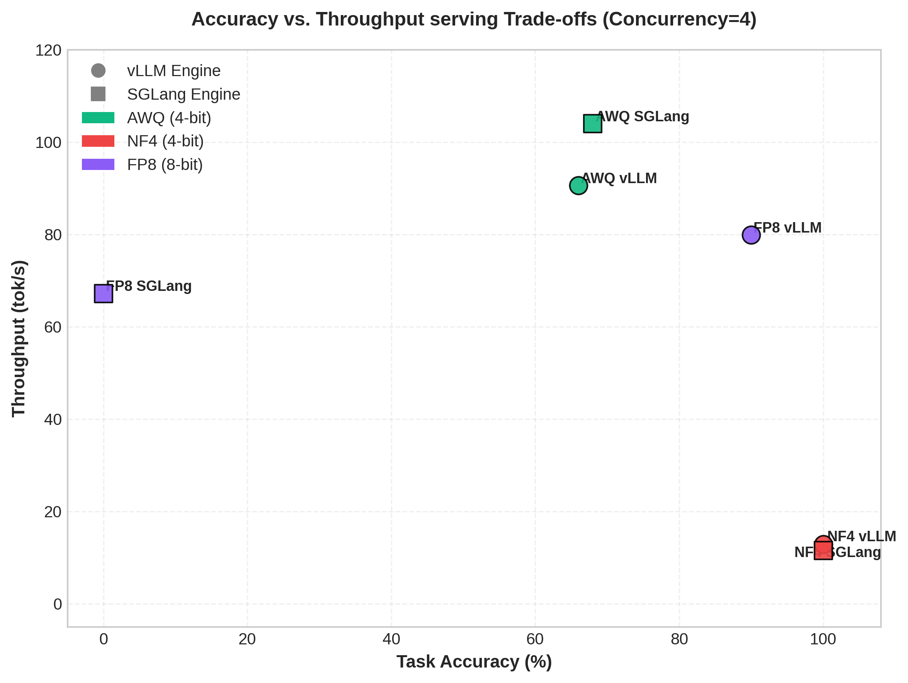
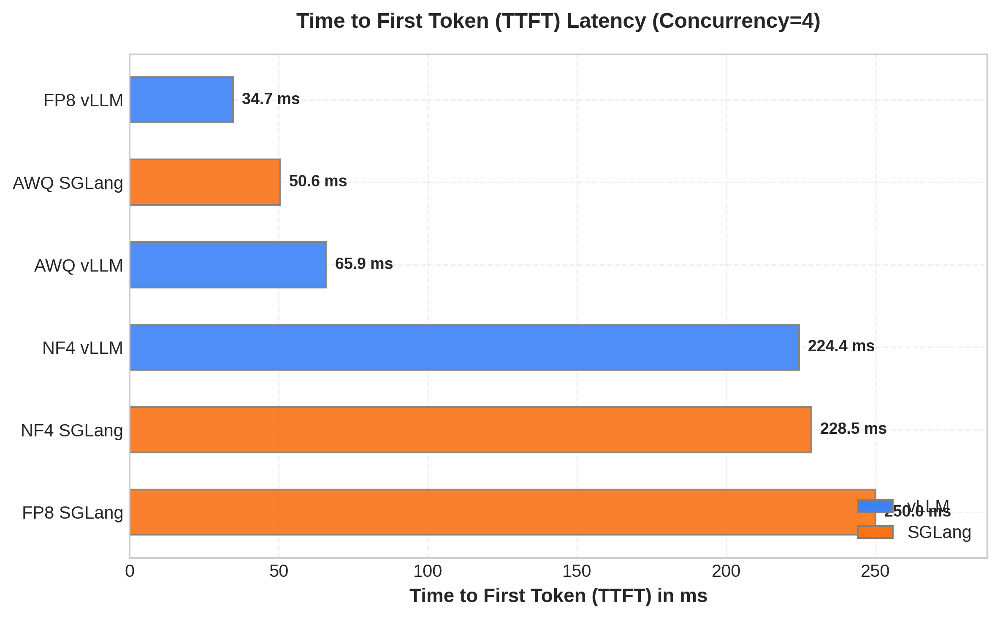
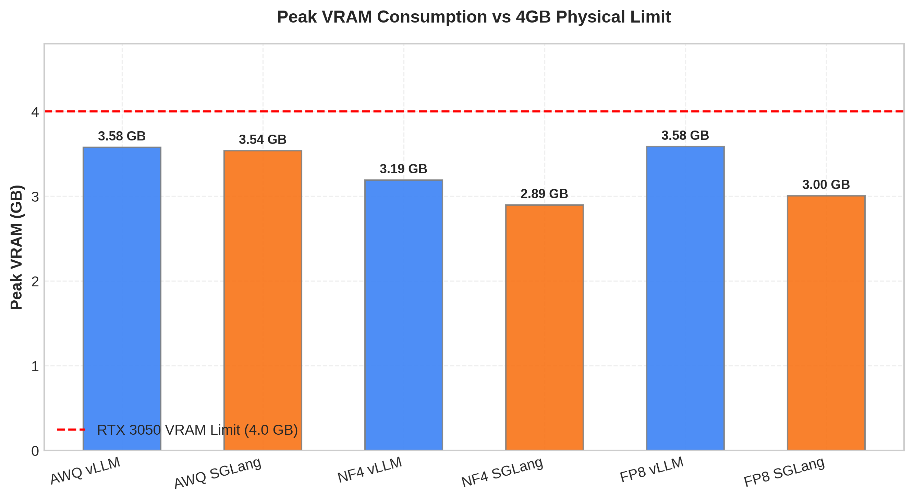
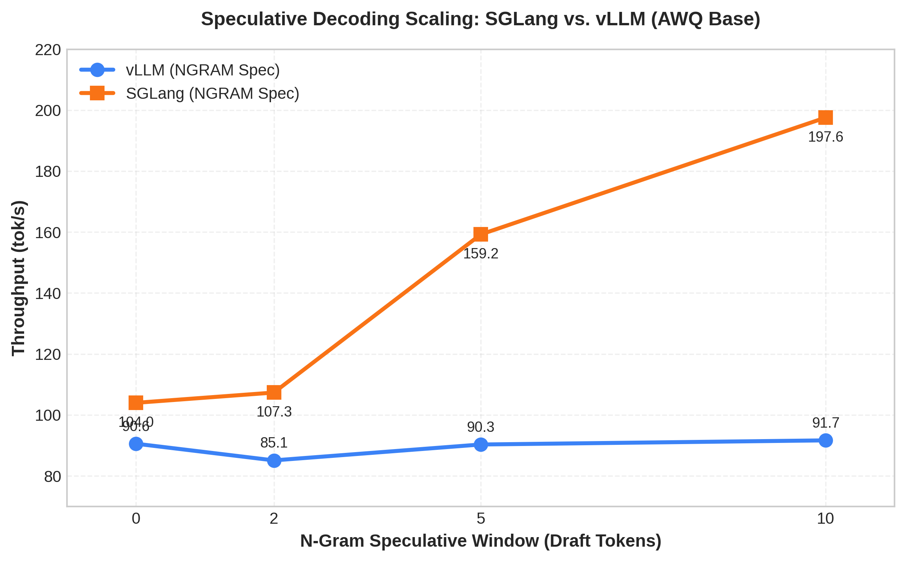
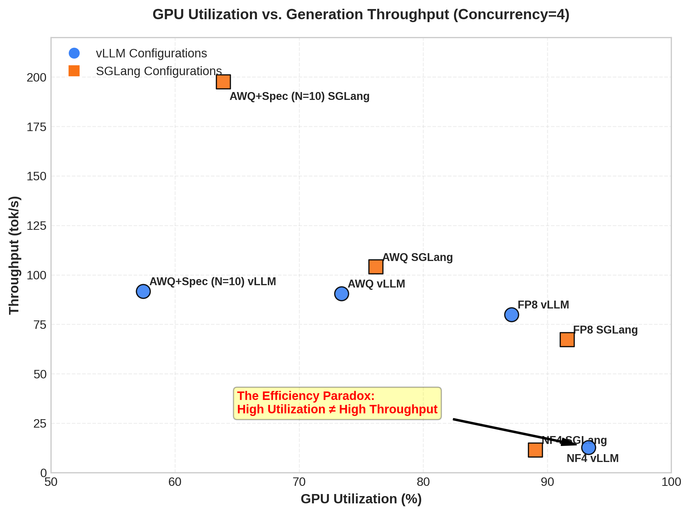
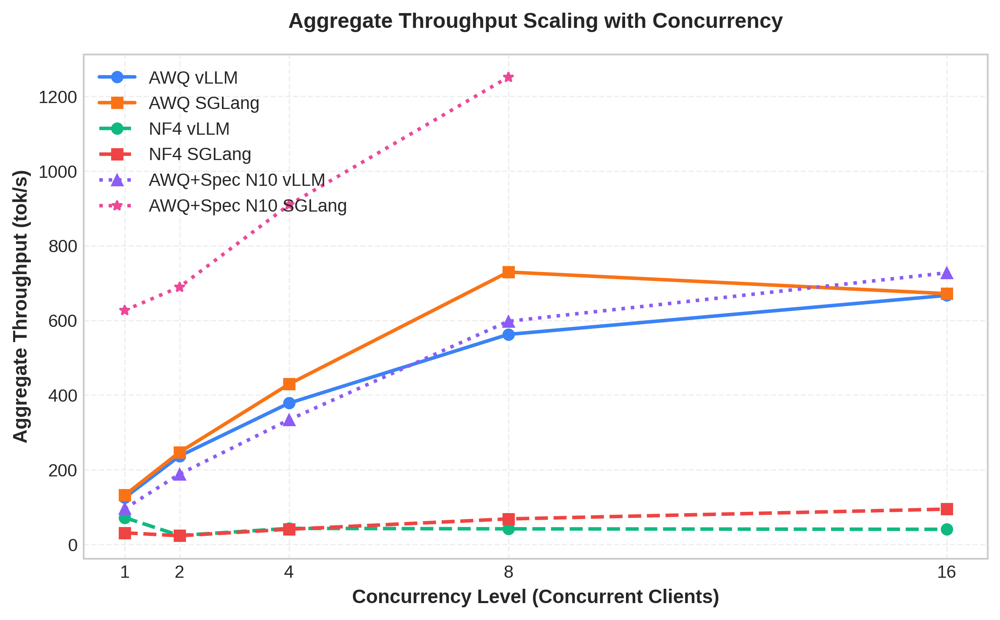
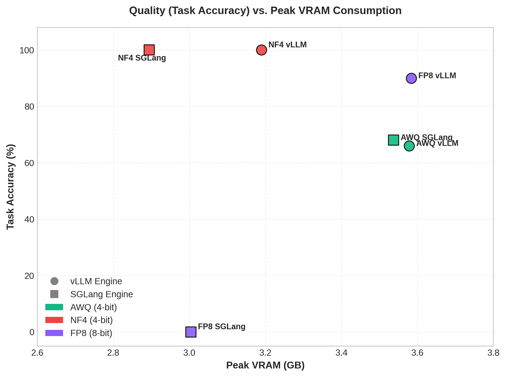
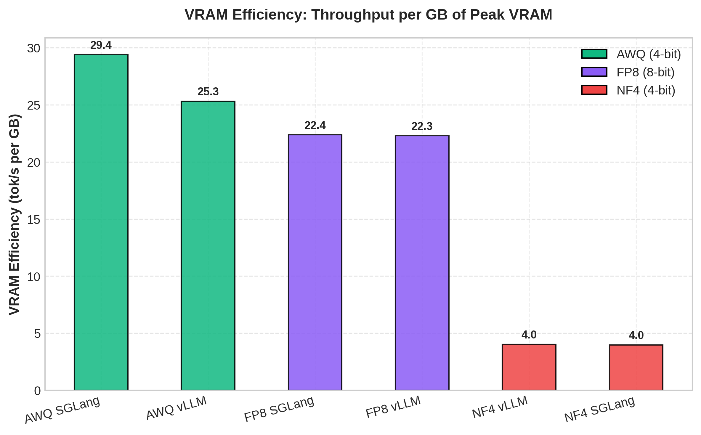

# Qwen2.5-1.5B — Fine-Tuning, Quantization & Multi-Engine Serving Benchmarks

A comprehensive research study on fine-tuning [Qwen2.5-1.5B](https://huggingface.co/Qwen/Qwen2.5-1.5B) for structured instructional generation, and systematically benchmarking its serving performance and generation quality across different post-training quantization (PTQ) formats (**FP16, AWQ, NF4, FP8**) on two high-performance inference engines: **vLLM** and **SGLang** under strict hardware limits.

## Hardware & Software Environment
* **Operating System:** Arch Linux (x86_64, rolling build)
* **GPU Hardware:** NVIDIA GeForce RTX 3050 Laptop GPU (4 GB GDDR6 VRAM, 60W TGP)
* **NVIDIA Driver Version:** 610.43.02
* **CUDA Version:** CUDA 13.3 (System Driver) / CUDA 13.0 (PyTorch Runtime)
* **Deep Learning Stack:** PyTorch 2.11.0+cu130 / vLLM v0.22.0 / SGLang v0.1.0
* **VRAM Constraints:** Strict 4.0 GB physical VRAM limit. Running the baseline model in FP16 triggers immediate Out-of-Memory (OOM) errors, necessitating Post-Training Quantization (PTQ) for local serving.

## Research Objectives
* **Quantization vs. Serving Engine Comparison:** The primary goal of this study is to evaluate how different quantization techniques (AWQ, NF4, FP8) affect model performance and quality when served under different inference engines (**vLLM** and **SGLang**). The focus is specifically on inference performance, latency, and scheduling efficiency differences between serving architectures, rather than the linguistic quality of the outputs.
* **Quantization Impact:** Analyze the performance-to-quality trade-offs of 4-bit (AWQ, NF4) and 8-bit (FP8) compression techniques.
* **Engine Architecture Evaluation:** Compare scheduler efficiency, memory pool management, and concurrency scaling between vLLM and SGLang.
* **Speculative Decoding Sweeps:** Evaluate throughput scaling vs VRAM overhead for CPU and GPU N-gram speculative execution under scaling user concurrency.

## Performance & Quality Overview (Concurrency = 4)

Below is a comprehensive summary of the baseline performance and quality metrics across all 13 served configurations at Concurrency 4 (greedy decoding, 128-token outputs):

| Configuration | Serving Engine | Throughput (tok/s) | Avg TTFT (ms) | Avg ITL (ms/tok) | Prefill TPS (tok/s) | Decode TPS (tok/s) | Peak VRAM (GB) | GPU Util % | Observed Acc % (50 prompts) | BERTScore F1 % | ROUGE-L % |
| :--- | :--- | :---: | :---: | :---: | :---: | :---: | :---: | :---: | :---: | :---: | :---: |
| **Baseline FP16** | vLLM / SGLang | *OOM* | *OOM* | *OOM* | *OOM* | *OOM* | — | — | — | — | — |
| **Baseline AWQ** | vLLM | 90.57 ± 18.89 | 65.92 ± 53.95 | 8.73 | 4210.68 | 104.87 | 3.58 ± 0.00 | 73.42% | 66.00% | 18.03% | 20.81% |
| **Baseline AWQ** | SGLang | 103.98 ± 22.09 | 50.60 ± 48.05 | 8.68 | 6284.43 | 117.26 | 3.54 ± 0.00 | 76.18% | 68.00% | 18.31% | 21.14% |
| **AWQ + Speculative (N=2)** | vLLM | 85.10 ± 13.07 | 51.36 ± 38.99 | 13.41 | 5316.03 | 93.94 | 3.59 ± 0.00 | 51.87% | 66.00% | 18.04% | 20.73% |
| **AWQ + Speculative (N=5)** | vLLM | 90.31 ± 12.42 | 50.13 ± 38.07 | 13.50 | 5376.19 | 100.52 | 3.61 ± 0.00 | 51.53% | 66.00% | 18.06% | 20.77% |
| **AWQ + Speculative (N=10)** | vLLM | 91.66 ± 16.97 | 52.03 ± 40.19 | 14.02 | 5275.31 | 101.63 | 3.40 ± 0.00 | 57.43% | 66.00% | 60.14% | 20.77% |
| **AWQ + Speculative (N=20)** | vLLM | 85.88 ± 12.17 | 56.85 ± 44.44 | 15.02 | 4813.34 | 96.66 | 3.67 ± 0.00 | 61.35% | 66.00% | 17.99% | 20.74% |
| **AWQ + Speculative (N=2)** | SGLang | 107.35 ± 39.94 | 45.25 ± 39.39 | 14.27 | 6526.57 | 117.94 | 3.53 ± 0.01 | 74.22% | 68.00% | 17.64% | 20.27% |
| **AWQ + Speculative (N=5)** | SGLang | 159.23 ± 86.05 | 44.81 ± 38.41 | 17.45 | 6491.21 | 183.67 | 3.57 ± 0.00 | 57.30% | 68.00% | 17.68% | 20.46% |
| **AWQ + Speculative (N=10)** | SGLang | 197.56 ± 127.11 | 46.35 ± 37.13 | 21.34 | 5994.16 | 248.72 | 3.64 ± 0.02 | 63.90% | 68.00% | 18.26% | 21.00% |
| **AWQ + Speculative (N=5, GPU)**| vLLM | 87.70 ± 23.04 | 146.03 ± 182.08 | 15.51 | 3633.13 | 104.72 | 3.60 ± 0.00 | 55.28% | 66.00% | 18.06% | 20.77% |
| **BitsAndBytes NF4** | vLLM | 12.84 ± 0.32 | 224.39 ± 5.02 | 76.67 | 867.07 | 13.58 | 3.19 ± 0.00 | 93.31% | **100.00%** | 27.58% | **29.36%** |
| **BitsAndBytes NF4** | SGLang | 11.51 ± 0.42 | 228.49 ± 82.24 | 82.54 | 929.20 | 12.15 | **2.89 ± 0.00** | 89.05% | **100.00%** | **64.34%** | 29.06% |
| **FP8 Dynamic (W8A8)** | vLLM (Patched)| 79.90 ± 0.02 | **34.69 ± 0.19** | 11.64 | 5537.29 | 86.01 | 3.58 ± 0.00 | 87.11% | 90.00% | 21.52% | 23.52% |
| **FP8 Dynamic (W8A8)** | SGLang | 67.20 ± 0.17 | 250.01 ± 2.95 | 13.03 | 756.70 | 77.35 | 3.00 ± 0.00 | 91.59% | 0.00% | 22.66% | 0.00% |

> [!IMPORTANT]
> **FP16 Quality Baseline Note:** Quality comparisons were performed against the merged FP16 checkpoint executed through a lightweight Hugging Face Transformers runtime rather than vLLM/SGLang, which could not host the FP16 model within the 4 GB VRAM budget.
>
> **FP8 Quality Metric Warning:** Quality metrics for FP8 should be interpreted cautiously because the checkpoint generated semantically corrupted outputs under SGLang and unpatched vLLM, indicating a serving-layer incompatibility rather than a quantization-quality failure. Applying a custom weight transposition patch on square matrices under vLLM restored the observed accuracy on the evaluation subset to 90.00%. Note that the primary focus of these benchmarks is to evaluate model serving performance and efficiency differences between inference runtimes.

## Repository Structure

```
├── train.py                          # QLoRA fine-tuning script
├── merge_model.py                    # Model weights merging script
├── quantize.py                       # AWQ and FP8 compression workflows
├── inference.py                      # Unified benchmarking suite
├── docs/                             # Research documentation & case studies
│   ├── quantization_serving_case_study.md       # Full comparative research report
│   ├── metrics_comparison_and_tradeoffs.md      # Performance vs quality trade-offs analysis
│   ├── model_configs_and_server_params.md       # Server launch parameter rationales
│   ├── experimental_challenges_and_mitigations.md # Hardware constraints & mitigations
│   └── challenges_loopholes_and_contradictions.md # Critique of theoretical vs practical findings
├── results/                          # Detailed metric logs across 13 test folders
```

## Steps to Reproduce

Follow these sequential steps to set up the environment, train the model, perform quantization, and execute the benchmark suite.

### 1. Environment Setup

This repository is managed using [uv](https://github.com/astral-sh/uv) for fast, reproducible dependency resolution.

**Prerequisites:**
- Linux OS
- Python 3.12
- NVIDIA GPU with CUDA runtime installed

Initialize the virtual environment and synchronize all required packages from `pyproject.toml` and `uv.lock`:
```bash
# Create the virtual environment
uv venv

# Synchronize and install dependencies
uv sync
```

---

### 2. Model Training & Adapter Merging

Fine-tune the base Qwen2.5-1.5B model using QLoRA on the provided taxonomy dataset, then merge the learned adapters back into the base weights to generate the reference FP16 merged model.

```bash
# Step A: Fine-tune the Qwen model using QLoRA
uv run python train.py

# Step B: Merge the trained LoRA adapter weights into the base model
uv run python merge_model.py
```
This generates the unquantized merged model at `./models/qwen-1.5b-merged`.

---

### 3. Model Quantization

Using the merged FP16 checkpoint as a source, generate the compressed configurations:

#### A. AWQ 4-Bit Model
AWQ utilizes activation-aware scaling based on calibration data to prevent significant quantization error. Run the script:
```bash
uv run python quantize_awq.py
```
This outputs the AWQ model to `./models/qwen-1.5b-awq`.

#### B. FP8 Dynamic 8-Bit Model
FP8 dynamic calibration is conducted using the `llmcompressor` library. Run:
```bash
uv run python quantize.py
```
This outputs the FP8 model to `./models/qwen-1.5b-fp8`.

#### C. BitsAndBytes NF4 Model
Unlike AWQ and FP8, BitsAndBytes NF4 (4-bit NormalFloat) does **not** require offline calibration or compilation. Instead, it is loaded and dequantized dynamically in-flight at startup. Under vLLM/SGLang, this is configured on-the-fly using the `--quantization bitsandbytes --load-format bitsandbytes` launch parameters (see server configuration steps in `docs/model_configs_and_server_params.md`).

---

### 4. Benchmarking the Models

The benchmarking process is split into serving engine launch and client performance/quality sweeps using the scripts inside the `benchmark` directory.

#### Step A: Launch the Serving Engine
Start either the **vLLM** or **SGLang** server with your target quantized model and specific parameters. Refer to [docs/model_configs_and_server_params.md](docs/model_configs_and_server_params.md) for the exact CLI commands for each of the 13 configurations.

#### Step B: Execute Client Benchmark Scripts
Once the engine is running and healthy on port 8000, run the corresponding scripts in the `benchmark/` directory to evaluate the model:

```bash
# 1. Evaluate Serving Performance (TTFT, ITL, Prefill/Decode Throughput, VRAM, and GPU Util)
# Arguments: --model [fp16|awq|nf4|fp8] --engine [vllm|sglang]
uv run python benchmark/run_performance.py --model awq --engine vllm

# 2. Evaluate Model Output Quality (Task Accuracy, BERTScore F1, and ROUGE-L)
# Arguments: --model [fp16|awq|nf4|fp8] --engine [vllm|sglang]
uv run python benchmark/run_quality.py --model awq --engine vllm

# 3. Evaluate Concurrency Scaling (Throughput under scaling concurrency levels: 1, 2, 4, 8, 16)
# Arguments: --model [fp16|awq|nf4|fp8] --engine [vllm|sglang]
uv run python benchmark/run_scaling.py --model awq --engine vllm
```

The performance, quality, and scaling output summaries will be appended to the files under the `results/` directory.

## Key Findings

1. **FP8 Dynamic Serving Compatibility:** Dynamic FP8 initially failed with garbage output on both runtimes. Evidence strongly suggests the issue originates from FP8 kernel handling of square projection matrices within the serving stack. Applying a custom weight transposition patch in vLLM's loader restored the observed accuracy on the evaluation subset to **90.00%** (at 79.9 tok/s), suggesting the failure was a software-level transposition mismatch rather than Ampere hardware limitations.
2. **Dynamic In-flight Dequantization Costs (NF4):** NF4 preserved the original model's performance on the evaluation subset, achieving 100.00% observed accuracy on the evaluation subset while introducing no measurable degradation. However, it ran at only **11.5–12.8 tok/s** due to on-chip dequantization compute bounds. In absolute terms, serving NF4 in vLLM consumed **3.19 GB of VRAM**, exceeding the **3.11 GB** VRAM footprint of native FP16 execution in a lightweight Transformers wrapper.
3. **Speculative Decoding CPU Bottlenecks:** Under SGLang, N-gram speculative decoding achieved a **+90% throughput speedup** (N = 10, 197.56 tok/s), but CPU-bound draft token generation under vLLM resulted in a throughput degradation at small draft sizes (N = 2).
4. **Speculative Concurrency OOMs:** Model-less speculative decoding is not zero-cost. While it avoids draft weights, its parallel sequence activation footprint increased VRAM by **100 MB**, causing SGLang speculative runs (N >= 5) to OOM at Concurrency 16, whereas SGLang N = 2 remained stable up to 16 concurrent clients (765.94 tok/s).


## Benchmark Visualizations & Figures

### Figure 1: Throughput Comparison across Quantization & Runtimes

**Conclusion:** AWQ delivered the highest generation throughput, reaching 104 tok/s on SGLang and 91 tok/s on vLLM, demonstrating that AWQ is the most inference-optimized quantization strategy among those tested. FP8 achieved competitive throughput, particularly on vLLM, while NF4 exhibited significantly lower throughput despite comparable memory usage. This behavior occurs because AWQ is specifically designed for fast inference kernels, whereas NF4 requires additional dequantization operations during generation, increasing computational overhead and reducing token production rates.

### Figure 2: Accuracy vs Throughput Trade-offs

**Conclusion:** The results reveal a clear trade-off between model quality and serving performance. NF4 maintained near-baseline accuracy (~100%) but suffered from the lowest throughput, making it unsuitable for latency-sensitive workloads. AWQ achieved the highest throughput but incurred a measurable quality degradation, while FP8 occupied a middle ground by preserving most of the model quality while maintaining high serving speed. The FP8 SGLang result demonstrates that deployment compatibility can be as important as quantization quality, as runtime incompatibilities can negate theoretical advantages.

### Figure 3: Time-to-First-Token (TTFT) Latency

**Conclusion:** AWQ and FP8 on vLLM produced the fastest initial response times, with FP8 vLLM achieving the lowest TTFT of approximately 35 ms. In contrast, NF4 incurred substantially higher startup latency exceeding 220 ms. This behavior can be attributed to the additional runtime overhead introduced by NF4 dequantization and execution kernels, which delay the generation of the first token despite preserving model quality.

### Figure 4: Peak VRAM Consumption

**Conclusion:** All evaluated configurations successfully operated within the 4 GB VRAM constraint of the RTX 3050. NF4 achieved the lowest memory footprint, reducing peak memory usage by approximately 15–20% relative to AWQ and FP8. However, the memory savings did not translate into performance gains, indicating that memory efficiency alone is insufficient for maximizing serving throughput on constrained hardware.

### Figure 5: Speculative Decoding Scaling (AWQ Base)

**Conclusion:** Speculative decoding provided substantial performance improvements for SGLang but produced minimal gains for vLLM. Increasing the N-gram draft window from 0 to 10 nearly doubled throughput in SGLang, reaching almost 200 tok/s, whereas vLLM remained relatively unchanged around 90 tok/s. This suggests that SGLang's speculative decoding implementation is more effective at exploiting draft-token acceptance than the corresponding vLLM configuration used in this study.

### Figure 6: GPU Utilization vs Generation Throughput

**Conclusion:** Higher GPU utilization did not necessarily result in higher generation throughput. NF4 consistently utilized over 90% of the GPU while producing only 11–13 tok/s, whereas AWQ achieved over 100 tok/s at substantially lower utilization levels. This demonstrates that GPU utilization alone is not a reliable indicator of serving efficiency, as computational resources may be consumed by quantization-related overheads rather than productive token generation.

### Figure 7: Aggregate Throughput Scaling with Concurrency

**Conclusion:** AWQ demonstrated strong scalability as concurrency increased, particularly on SGLang where throughput exceeded 700 tok/s under moderate load. The addition of speculative decoding further improved scaling behavior, allowing SGLang to surpass 1200 tok/s at high concurrency levels. In contrast, NF4 exhibited poor scaling characteristics, indicating that its computational bottlenecks limit the benefits obtainable from request batching and concurrent execution.

### Figure 8: Quality vs Peak VRAM Consumption

**Conclusion:** NF4 achieved the highest quality-to-memory ratio, preserving baseline model accuracy while operating at the lowest memory footprint. AWQ sacrificed some accuracy in exchange for significantly improved serving performance, while FP8 provided a balanced compromise between memory efficiency, quality retention, and throughput. These results highlight that the optimal quantization strategy depends on deployment priorities: NF4 for quality preservation, AWQ for serving performance, and FP8 for balanced operation.

### Figure 9: Throughput per GB VRAM (VRAM Efficiency)

**Conclusion:** AWQ SGLang delivered the highest efficiency of 29.4 tok/s/GB, followed by AWQ vLLM at 25.3 tok/s/GB and FP8 configurations around 22 tok/s/GB. NF4 configurations performed poorly under this metric, achieving only 4.0 tok/s/GB on both runtimes. This highlights that while NF4 offers a smaller memory footprint, its significant computational overhead during dynamic dequantization makes it highly inefficient in throughput-to-memory utilization compared to static quantization options.

---

## Project Conclusion

Across all experiments, AWQ emerged as the most practical quantization strategy for resource-constrained inference, consistently delivering the highest throughput and best scalability characteristics. NF4 preserved model quality most effectively but suffered from severe throughput limitations, making it unsuitable for real-time serving workloads. FP8 demonstrated promising performance-quality trade-offs but exposed significant runtime compatibility challenges, illustrating that deployment support is a critical factor when evaluating modern quantization methods.


## Documentation & Case Studies

| Document | Description |
| :--- | :--- |
| **[Comparative Case Study](docs/quantization_serving_case_study.md)** | Full comparative research report analyzing latency, throughput, VRAM, and quality across all 13 served configs. |
| **[Metrics & Tradeoffs Analysis](docs/metrics_comparison_and_tradeoffs.md)** | Deep dive into the trade-offs between speed, accuracy, and memory utilization for AWQ, NF4, FP8, and FP16. |
| **[Server Params & Configs](docs/model_configs_and_server_params.md)** | Detailed startup commands and technical rationales for vLLM and SGLang parameters. |
| **[Experimental Challenges](docs/experimental_challenges_and_mitigations.md)** | Detailed journal of hardware limitations, software bottlenecks, and mitigation workflows. |


